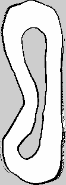
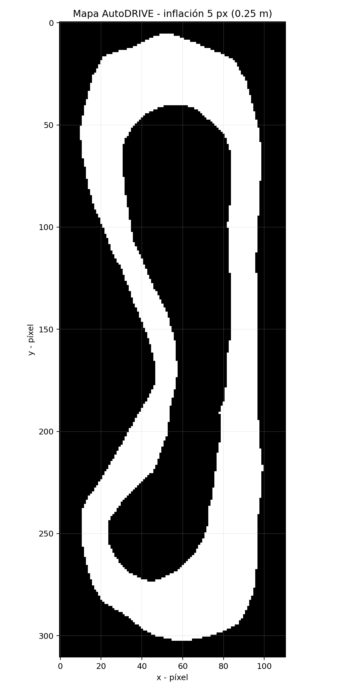
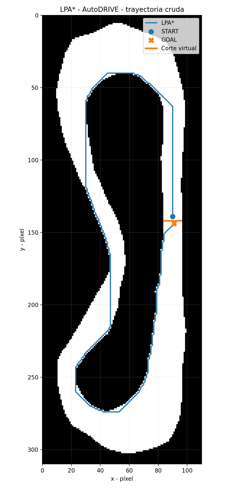
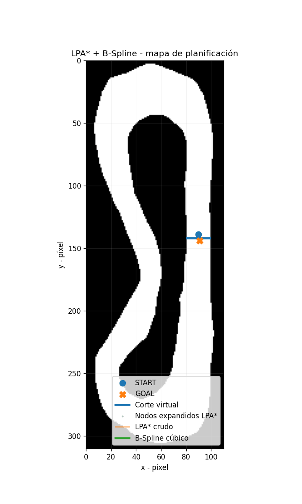
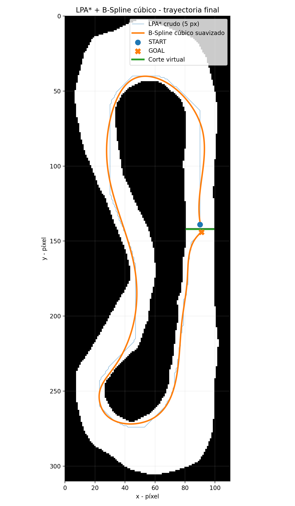

# Mapeo y Planificación Global en AutoDRIVE

Proyecto desarrollado para el vehículo F1TENTH utilizando:

- ROS 2 Humble
- AutoDRIVE Simulator
- SLAM Toolbox
- Lifelong Planning A* (LPA*)
- B-Spline cúbico
- RViz2

El objetivo del proyecto es realizar el flujo completo:

**Mapeo → Planificación global → Suavizado → Visualización del Path**

---

## 🎥 Video demostrativo

**YouTube:** https://youtu.be/L63VlOEhgmk

El video demostrativo evidencia:

- SLAM en ejecución mientras se construye el mapa.
- GIF del algoritmo LPA* generando la trayectoria.
- Comparación entre trayectoria cruda y suavizada.
- Visualización del Path final superpuesto en RViz y AutoDRIVE.

---

## 1. Mapeo mediante SLAM

El mapa fue generado utilizando **SLAM Toolbox** a partir de los datos proporcionados por el sensor LiDAR del vehículo F1TENTH dentro de AutoDRIVE.

### Datos del mapa

| Parámetro | Valor |
|---|---:|
| Dimensiones | 111 × 311 px |
| Resolución | 0.05 m/px |
| Origen | [-3.83, -8.59, 0] |
| Formato | PGM + YAML |

### Mapa obtenido



Los archivos originales se encuentran en:

```text
src/path_planning/maps/
├── Proyecto_F1Tenth_Map.pgm
└── Proyecto_F1Tenth_Map.yaml
```

La configuración utilizada para SLAM Toolbox se encuentra en:

```text
src/path_planning/config/mapper_params_online_async.yaml
```

Los principales parámetros utilizados fueron:

```yaml
odom_frame: map
map_frame: slam_map
base_frame: f1tenth_1
scan_topic: /autodrive/f1tenth_1/lidar
```

---

## 2. Preparación del mapa para planificación

Para utilizar el mapa generado mediante SLAM dentro del planificador global, se interpretaron los valores del archivo PGM de la siguiente manera:

```text
254 → espacio libre
205 → espacio desconocido / no transitable
0   → obstáculo / no transitable
```

También se realizó una inflación de obstáculos para mantener la trayectoria alejada de las paredes.

```text
Inflación = 5 píxeles
Resolución = 0.05 m/píxel

5 × 0.05 = 0.25 m
```

Por lo tanto, se utilizó aproximadamente una distancia de seguridad de **0.25 metros** durante la planificación.

### Mapa con inflación de obstáculos



---

## 3. Planificación global mediante LPA*

El algoritmo asignado para la planificación global fue **Lifelong Planning A* (LPA*)**.

Los puntos seleccionados fueron:

```text
START Pixel: (90, 139)
START Grid:  (90, 171)

GOAL Pixel:  (91, 144)
GOAL Grid:   (91, 166)
```

Debido a que START y GOAL se encuentran muy próximos entre sí, se añadió un corte virtual en una sección de la pista.

Este corte evita que el algoritmo seleccione directamente el camino corto entre ambos puntos y obliga al planificador a realizar el recorrido global del circuito.

### Resultados de LPA*

| Parámetro | Resultado |
|---|---:|
| Nodos de trayectoria | 502 |
| Costo Grid | 555.262 |
| Longitud aproximada | 27.763 m |
| Colisiones | 0 |

### Trayectoria cruda



---

## 4. Animación del algoritmo

El siguiente GIF permite observar visualmente el proceso de planificación.

Se muestran las siguientes etapas:

1. Mapa utilizado por el planificador.
2. Expansión de nodos mediante LPA*.
3. Trayectoria global cruda encontrada.
4. Aplicación del proceso de suavizado.
5. Trayectoria global final.



---

## 5. Suavizado mediante B-Spline cúbico

La trayectoria obtenida directamente mediante LPA* presenta cambios bruscos de dirección debido a que el algoritmo trabaja sobre una cuadrícula discreta.

Para mejorar la continuidad y obtener una trayectoria más apropiada para el movimiento del vehículo, se aplicó un **B-Spline cúbico utilizando SciPy**.

Durante las pruebas se evaluaron diferentes valores de suavizado:

```text
s = 5000 → colisión
s = 4000 → colisión
s = 3000 → colisión
s = 2500 → colisión
s = 2000 → colisión
s = 1500 → válido
```

Por esta razón se seleccionó:

```text
s = 1500
```

como el mayor nivel de suavizado probado que mantiene una trayectoria válida y libre de colisiones.

### Comparación de resultados

| Métrica | LPA* crudo | B-Spline |
|---|---:|---:|
| Longitud | 27.763 m | 26.581 m |
| Puntos | 502 | 1000 |
| Colisiones | 0 | 0 |

La reducción obtenida fue:

```text
Reducción = 1.182 m
Reducción porcentual = 4.26 %
```

### Comparación visual



---

## 6. Publicación del Path en ROS 2

La trayectoria suavizada final se encuentra almacenada en:

```text
src/path_planning/data/lpa_autodrive_smooth_final.csv
```

El archivo contiene:

```text
index
grid_x
grid_y
world_x
world_y
yaw
```

La trayectoria final contiene **1000 puntos**.

El nodo ROS 2 implementado para publicar esta trayectoria es:

```text
global_path_publisher
```

El nodo publica:

```text
Topic: /global_path
Type: nav_msgs/msg/Path
Frame: slam_map
Puntos: 1000
```

### Compilación

Desde la raíz del repositorio:

```bash
cd ~/F1Tenth-Repository

source /opt/ros/humble/setup.bash

colcon build \
  --symlink-install \
  --packages-select path_planning

source install/setup.bash
```

### Ejecución

```bash
ros2 run path_planning global_path_publisher
```

La salida esperada es:

```text
Trayectoria cargada: 1000 puntos
Publicando en /global_path, frame=slam_map
```

Para visualizarlo en RViz:

```text
Fixed Frame: slam_map
Path Topic: /global_path
```

---

## 7. Estructura principal del proyecto

```text
src/path_planning/
│
├── path_planning/
│   ├── __init__.py
│   ├── waypoint_recorder.py
│   └── global_path_publisher.py
│
├── project_code/
│   └── f1tenth/
│       ├── autodrive_common.py
│       ├── lpa_autodrive_5px.py
│       ├── smooth_lpa_scipy.py
│       ├── lpa_autodrive_gif_final.py
│       └── validate_lpa_raw.py
│
├── maps/
│   ├── Proyecto_F1Tenth_Map.pgm
│   └── Proyecto_F1Tenth_Map.yaml
│
├── config/
│   └── mapper_params_online_async.yaml
│
├── data/
│   ├── lpa_autodrive_raw_5px.csv
│   └── lpa_autodrive_smooth_final.csv
│
├── package.xml
├── setup.py
└── README.md
```

Las imágenes y animaciones de evidencia se encuentran en:

```text
img/proyecto_autodrive/
├── mapa_slam.png
├── autodrive_map_inflated_5px.png
├── lpa_autodrive_raw_5px.png
├── lpa_autodrive_smooth_final.png
└── lpa_autodrive_animation_final.gif
```

---

## 8. Flujo general del sistema

```text
AutoDRIVE Simulator
        ↓
     LiDAR
        ↓
  SLAM Toolbox
        ↓
  Mapa PGM/YAML
        ↓
       LPA*
        ↓
Trayectoria cruda
        ↓
 B-Spline cúbico
        ↓
Trayectoria suavizada
        ↓
 nav_msgs/Path
        ↓
 RViz / AutoDRIVE
```

---

## 9. Resultado final

Se logró realizar el flujo completo de mapeo y planificación global dentro del entorno AutoDRIVE.

La trayectoria global final:

- Fue generada mediante LPA*.
- Fue suavizada mediante B-Spline cúbico.
- Contiene 1000 puntos.
- Tiene una longitud aproximada de 26.581 metros.
- Presenta 0 colisiones en la validación realizada.
- Puede ser publicada en ROS 2 mediante `/global_path`.
- Puede ser visualizada en RViz sobre el mapa generado mediante SLAM.

---

## Video del proyecto

🎥 **YouTube:** `PENDIENTE - PEGAR ENLACE AQUÍ`

